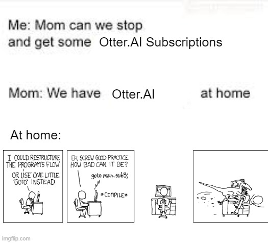

# Setup
## For Linux only
Install portaudio package, windows will install this with package with pyaudio.  
`sudo apt-get update && sudo apt-get install portaudio19-dev`  

## Continued setup.
Run `pip install -r requirements.txt`  
Run `python setup.py` to create the data directories and populate JOB_DEVICE_MAPPINGS  
See below for steps to generate the summaries locally vs with OpenAI  
Note: whisper may have ffmpeg as a requirement  

## Summarizing Locally
Modify the following values in config.yaml  
USE_LOCAL_LLAMA: True  
OPENAI_ENDPOINT: http://localhost:8080/v1/chat/completions  
LLAMA_SERVER: Update as necessary for windows/linux executables  
LLAMA_CONTEXT: Context limit depends on model, but 8k should be enough for a 30 minute meeting. 150 spoken wpm * 30 mins = 4500 words; 1 token ~ 3/4 words. Llama 3.1 models extend up to 128k context.  
LLAMA_PORT: 8080  

Download the correct build for your system. Extract the zip file into the ./models directory and rename the folder to 'llama.cpp'  
https://github.com/ggerganov/llama.cpp/releases/tag/b3557  

Download a GGUF model from here. I recommend the Q6_k.gguf.  
https://huggingface.co/bartowski/Meta-Llama-3.1-8B-Instruct-GGUF/tree/main  

You can read more about the perplexity and quantization tradeoffs here  
https://www.reddit.com/r/LocalLLaMA/comments/145tf00  

## Summarizing on OpenAI
Get an OpenAI API key https://platform.openai.com/docs/quickstart  

Modify the following values in config.yaml.  
USE_LOCAL_LLAMA: False  
OPENAI_API_KEY: api_key_here  
OPENAI_ENDPOINT: https://api.openai.com/v1/chat/completions  

## Transcribing on Whisper
The whisper model is small and can be run on CPU inference if necessary.  
Using the GPU requires nvidia cuda toolkit. You can check if it is installed by running `nvcc --version`  
Choose between the models below as specified here https://github.com/openai/whisper and set the config.yaml whisper model. Recommended model is base.en or small.en  
tiny, tiny.en, base, base.en, small, small.en, medium, medium.en, large, N/A  
Whisper models are saved in "~/.cache/whisper"  

## Capturing Desktop Audio
pyaudio can only read input audio streams, so there's no built-in way to capture desktop audio. However you can install any audio loopback tools to route your desktop audio to a virtual microphone. See some software recommendations below.  
Linux - PulseAudio, ALSA, JACK  
MacOS - Loopback, VB Audio, JACK  
Windows - Stereo Mix (by Realtek, needs to be enabled)  

# Usage
Navigate to the repository's base directory. The scripts must be executed in this base directory.  
Run `python main.py <job_index> <meeting_name>`  
Steps:  
- Record audio to a .wav file  
- Process .wav file into a transcript  
- Generate a summary from the transcript  

# Options
```
-s <option>,    --summary-prompt <option>    [default: "meeting"] Summary prompt to use
```



# Todo
- Feature: In job device mappings, use an index (ie 1, 2) or the company name (ie J1, J2) to trigger the main script. Or both?  
